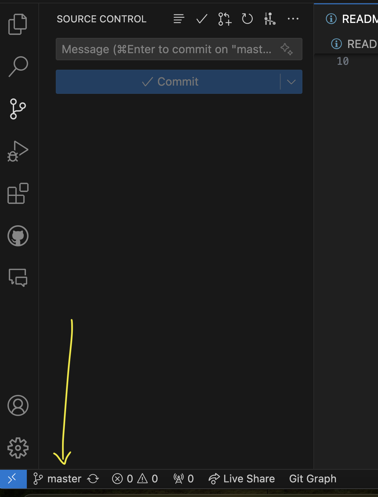
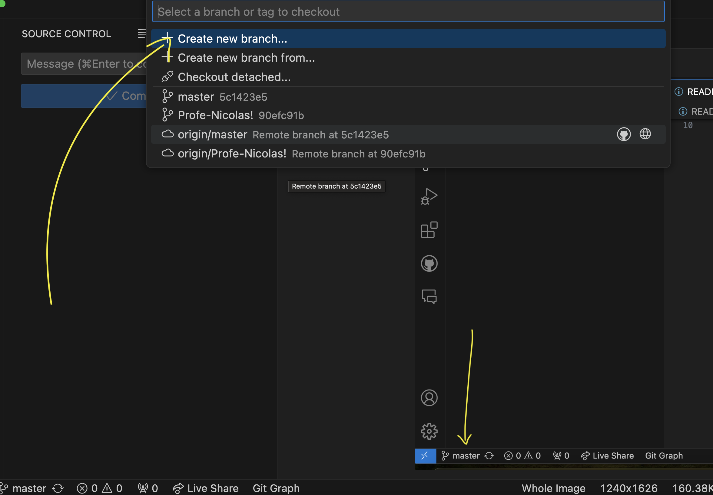
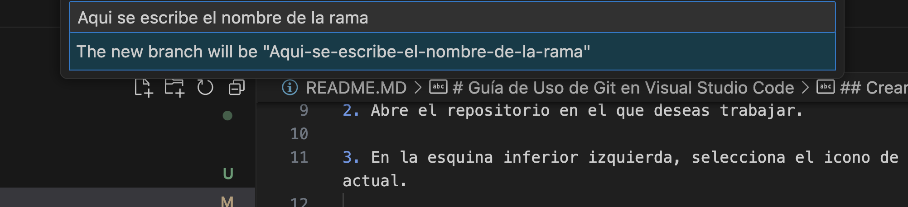
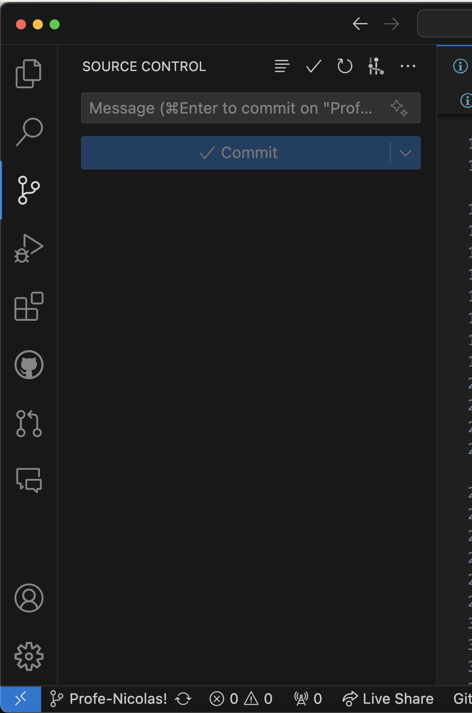
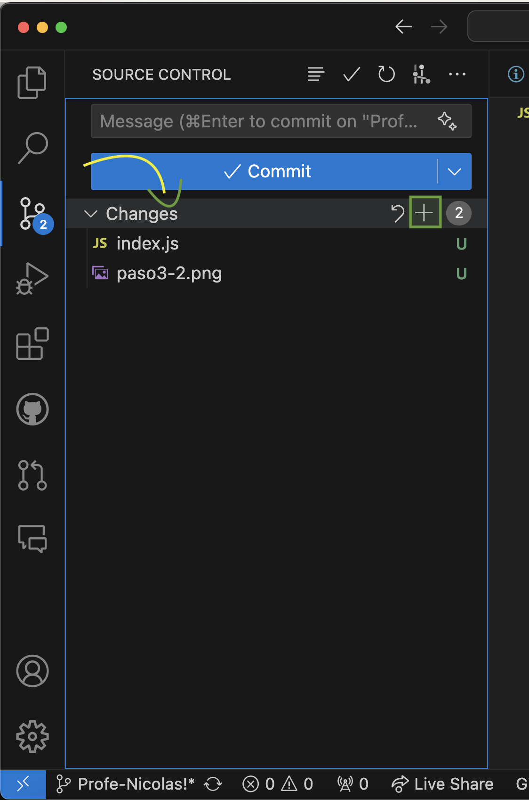
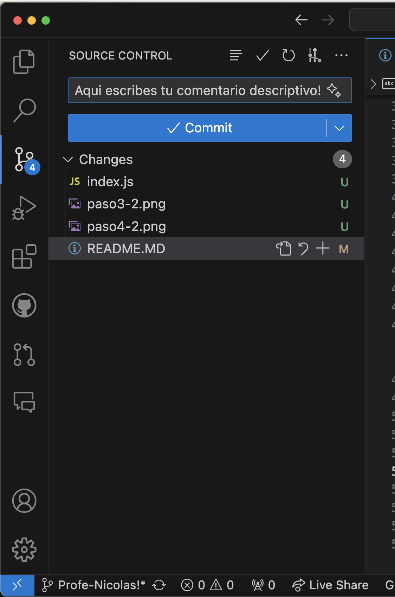

# Guía de Uso de Git en Visual Studio Code

Esta guía te proporcionará los pasos necesarios para utilizar Git en Visual Studio Code, incluyendo la creación de nuevas ramas y la realización de Pull Requests...

Rellena el siguiente formulario!

https://docs.google.com/forms/d/1eK1m_N7ZVfEAJ_8vcdIjpkKvV82UP97A0Fj_sCbpoow/edit?pli=1

## Crear una Nueva Rama

1. Abre Visual Studio Code y asegúrate de tener la extensión de Git instalada y activada.

2. Abre el repositorio en el que deseas trabajar.

3. En la esquina inferior izquierda, selecciona el icono de la rama actual.

   

4. Selecciona la opción "Create new branch" (Crear nueva rama).

   

5. Ingresa el nombre para tu nueva rama y presiona Enter.

   

6. ¡Listo! Ahora estás en tu nueva rama y puedes comenzar a trabajar en ella.

## Realizar Cambios y Crear Ramas en el Repositorio

1. Realiza los cambios necesarios en tu código.

2. Guarda los cambios utilizando Ctrl+S (o Cmd+S en macOS).

3. Abre la sección de control de origen en Visual Studio Code.

   

4. Haz clic en el icono de los cambios.

   

5. Selecciona los archivos que deseas incluir en tu commit.

   

6. Ingresa un mensaje descriptivo para tu commit y presiona Enter.

   

7. Para crear una nueva rama basada en tus cambios, selecciona la opción "Create a new branch and start typing to give it a name" (Crear una nueva rama y comienza a escribir para darle un nombre).

  
8. Ingresa el nombre para tu nueva rama y presiona Enter.

## Crear un Pull Request

1. Una vez que hayas terminado de trabajar en tu rama y estés listo para fusionar tus cambios con la rama principal, abre la sección de control de origen en Visual Studio Code.

2. Haz clic en el icono de los cambios.

3. Selecciona los archivos que deseas incluir en tu Pull Request.

4. Ingresa un mensaje descriptivo para tu commit y presiona Enter.

5. Haz clic en "Publish changes" (Publicar cambios) para enviar tus cambios a GitHub.

6. Ve a tu repositorio en GitHub y selecciona la pestaña "Pull Requests" (Solicitudes de extracción).

7. Haz clic en el botón "New pull request" (Nueva solicitud de extracción).

8. Selecciona las ramas que deseas comparar y haz clic en "Create pull request" (Crear solicitud de extracción).

9. ¡Listo! Tu Pull Request ha sido creado y ahora puedes revisarlo y fusionarlo con la rama principal.

---

